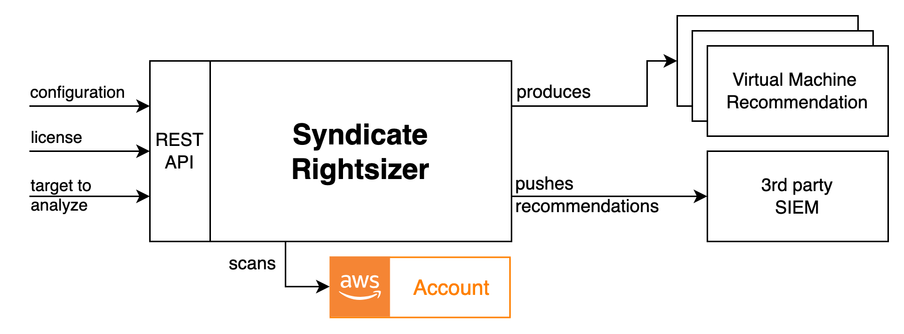

# EPAM Syndicate RightSizer

EPAM Syndicate Rightsizer is a solution that provides optimisation recommendations (like resize, family type change, schedule, shutdown) 
for virtual resources based on their activity metrics. Users can interact with the application via rest API and CLI. 
The main business purpose is to provide users with a convenient ways of cost/efficiency optimisation of their cloud resources.
Syndicate Rightsizer produces the instance recommendations according to the license available. 

### License
is a recommendation algorithm available to the License Owner during set period of time.
The following License features are available: 
1. Recommendation Algorithm - set of configuration parameters that are assembled to cover typical need of the customers like:
	1.1. provide general VM cost-optimisation recommendation, cloud-adjusted 
	1.2. cover specific cases according to the company's business and composition - any custom rules may be implemented 
		and assembled into an algorithm.
2. Quotas - Scans amount available - the amount of scans available for specified amount of time. For example: 5 scans per month; 1 per week;

 

## Deployment Options
The solution could be delivered in 2 deployment models: 
1. AWS Serverless Deployment - the deployment that utilizes such AWS Services like: 
	API Gateway, Cognito, Lambda, Batch, DynamoDB, S3, Systems Manager Parameter Store
2. Container-based Deployment - the deployment that utilizes the following software:
	Bottle, MongoDB, MinIO, Vault
3. Both of installations utilizes the DefectDojo delivered as a separate instance.

